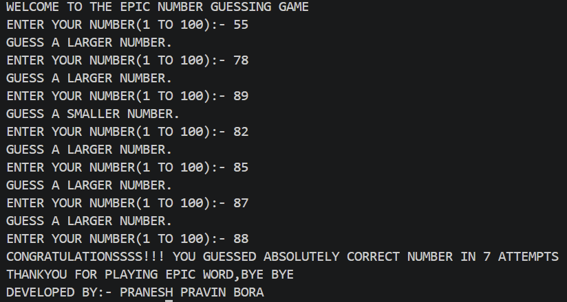

# 🎯 Epic Number Game

> 🎮 A console-based number guessing game built in C featuring random number generation, hints, and attempt tracking.

---

## 📌 Overview

**Epic Number Game** is a beginner-friendly console game developed using the **C programming language**.

The computer generates a random number between **1 and 100**, and the player has to guess the number.

After every incorrect guess, the game provides a hint:

- 🔼 **Guess a larger number**
- 🔽 **Guess a smaller number**
- 🎉 **Correct guess**

The game also tracks the total number of attempts taken by the player.

---

## ❓ Problem Statement

The objective of this project is to create an interactive console-based game that:

- 🎲 Generates a random number automatically
- ⌨️ Accepts guesses from the user
- 🔍 Compares the guess with the generated number
- 💡 Provides useful hints after every incorrect attempt
- 📊 Counts the number of attempts required to find the correct number

---

## 📊 Dataset

No external dataset is used in this project.

The number used by the game is generated dynamically using C's built-in random number generation functions.

🎲 **Number Range:** 1 – 100

---

## 🛠️ Tools and Technologies

| Technology | Purpose |
|---|---|
| 💻 C | Core programming language |
| 🧑‍💻 Visual Studio Code | Code editor |
| ⚙️ GCC | C compiler |
| 🖥️ Terminal | Program execution |
| 🌐 GitHub | Version control and project hosting |

---

## 🧠 Methods

The project uses the following programming concepts:

- 🔢 Variables and data types
- 🎲 Random number generation
- 🔀 Conditional statements (`if`, `else if`, `else`)
- 🔁 `do-while` loop
- 📥 User input using `scanf()`
- 🧮 Comparison operators
- 📈 Attempt counting
- ⏱️ Random seed generation using `srand(time(NULL))`

### 🎲 Random Number Generation

The game generates a number between 1 and 100 using:

```c
srand(time(NULL));
random = rand() % 100 + 1;
```
---

## 💡 Key Insights

Through this project, I learned and practiced:

- 📦 Variables and data types
- ⌨️ `printf()` and `scanf()`
- 📍 The address operator `&`
- 🔀 Conditional statements
- 🔁 `do-while` loops
- 🎲 Random number generation
- 🎯 `rand()` and `srand()`
- ⏰ `time(NULL)`
- 📊 Attempt tracking
- 🧠 Logical thinking
- 🐛 Debugging
- ⚙️ Compiling and running a C program
- 🖥️ Working with the terminal
- 🌐 Basic GitHub project management

---

## 🐛 Challenges & Debugging

While developing **Epic Number Game**, I faced two major mistakes that helped me understand important C programming concepts.

### 1️⃣ Incorrect Random Number Generation

#### ❌ Problem

Initially, I used:

```c
random = rand() * 100 + 1;
```

This generated a number much larger than the intended **1–100 range**, causing the guessing logic to behave incorrectly.

#### ✅ Solution

I changed it to:

```c
random = rand() % 100 + 1;
```

This generates a random number between **1 and 100**.

#### 💡 What I Learned

I learned how the **modulo operator `%`** can be used with `rand()` to generate a number within a specific range.

---

### 2️⃣ Incorrect `scanf()` Usage

#### ❌ Problem

Initially, I wrote:

```c
scanf("%d", guess);
```

The user's input was not being stored correctly because `scanf()` requires the memory address of the variable.

#### ✅ Solution

I changed it to:

```c
scanf("%d", &guess);
```

#### 💡 What I Learned

I learned why the **address operator `&`** is required when using `scanf()` to store user input.

This also helped me understand the relationship between variables and memory addresses in C.

---

## 📊 Game Flow

```text
                 🟢 START
                    │
                    ▼
          🎲 Generate Number 1–100
                    │
                    ▼
             ⌨️ Enter Your Guess
                    │
                    ▼
              🔍 Compare Guess
                    │
          ┌─────────┼─────────┐
          ▼         ▼         ▼
       Smaller    Equal     Larger
          │         │         │
          ▼         ▼         ▼
      🔼 Guess   🎯 Correct  🔽 Guess
       Larger     Number      Smaller
          │         │         │
          │         ▼         │
          │    📊 Show Attempts
          │         │         │
          └────🔄───┴─────────┘
                    │
                    ▼
                  🏁 END
```

---

## 🖥️ Sample Output

```text
🎯 WELCOME TO THE EPIC NUMBER GUESSING GAME

ENTER YOUR NUMBER (1 TO 100): 50
🔽 GUESS A SMALLER NUMBER.

ENTER YOUR NUMBER (1 TO 100): 25
🔼 GUESS A LARGER NUMBER.

ENTER YOUR NUMBER (1 TO 100): 37

🎉 CONGRATULATIONS!!!
YOU GUESSED THE CORRECT NUMBER IN 3 ATTEMPTS.

THANK YOU FOR PLAYING EPIC NUMBER, BYE BYE 👋

👨‍💻 DEVELOPED BY: PRANESH PRAVIN BORA
```

---
## 🖼️ Game Output



## ▶️ How to Run This Project

### 1️⃣ Clone the Repository

```bash
git clone https://github.com/Praneshbora0311/epic-number-game.git
```

### 2️⃣ Open the Project Directory

```bash
cd epic-number-game
```

### 3️⃣ Compile the Program

Using GCC:

```bash
gcc src/NUMBER_GUESSING_GAME.c -o epic-number
```

### 4️⃣ Run the Game

#### 🪟 Windows

```powershell
.\epic-number.exe
```

#### 🐧 Linux / macOS

```bash
./epic-number
```

---

## 📁 Project Structure

```text
epic-number-game/
│
├── 📄 NUMBER_GUESSING_GAME.c
└── 📄 README.md
```
---

## 🚀 Possible Future Improvements

The following features can be considered for future versions:

- 🎚️ Multiple difficulty levels
- 🏆 Scoring system
- 🔄 Replay option
- 🥇 High-score system
- 💾 File handling
- 📊 Player statistics
- ✨ Improved terminal interface

---

## 🏆 Results & Conclusion

The **Epic Number Game** successfully generates a random number between **1 and 100** and allows the player to repeatedly guess the number.

The program provides useful hints after every incorrect attempt and displays the total number of attempts once the correct number is guessed.

This project helped me move beyond basic C syntax and gain practical experience in:

- 💻 Writing a complete C program
- 🧠 Applying programming logic
- 🐛 Debugging errors
- ⚙️ Compiling and executing programs
- 📚 Documenting a project for GitHub
- 🌐 Managing a basic GitHub repository

🚀 **Epic Number Game is my first step toward building larger and more advanced software projects.**
---

## 👨‍💻 Author & Contact

### Pranesh Pravin Bora

🎓 First-Year Computer Science Engineering Student

💻 Currently learning C programming and building projects to strengthen my programming and software development fundamentals.

📧 **Email:** [praneshbora0311@gmail.com](mailto:praneshbora0311@gmail.com)

💼 **LinkedIn:** [linkedin.com/in/praneshbora](https://www.linkedin.com/in/praneshbora)

📱 **Contact:** +91 7498503346

🐙 **GitHub:** [Praneshbora0311](https://github.com/Praneshbora0311)

---

## ⭐ Support

If you found this project interesting, consider giving the repository a ⭐ **Star**!

---

> 🚀 **One project at a time. One concept at a time. Building towards something bigger.**
>
> 💻 *Built with C, curiosity, and a lot of debugging.* 😄

